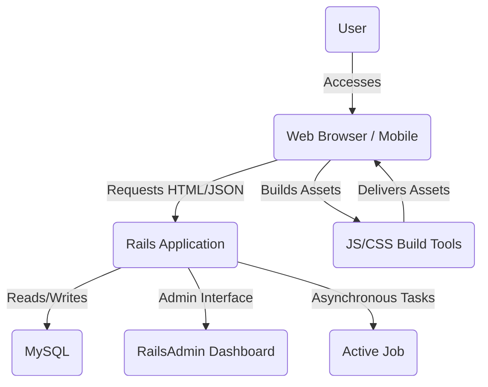

## Architecture & System Design

The application follows the Model-View-Controller (MVC) architectural pattern, characteristic of Ruby on Rails frameworks. It is a monolithic application with a clear separation of concerns:

*   **Models**: Handle data logic and interactions with the MySQL database using ActiveRecord.
*   **Views**: Render the user interface using ERB templates, enhanced with modern frontend tools like Bootstrap, Sass, and Hotwire for dynamic interactions.
*   **Controllers**: Process user input, interact with models, and prepare data for views, serving both HTML and JSON responses.

Frontend interactivity is significantly boosted by Hotwire (Turbo Rails for fast page navigation and Stimulus Rails for modest JavaScript enhancements), reducing the need for heavy client-side frameworks.

### Component Diagram

