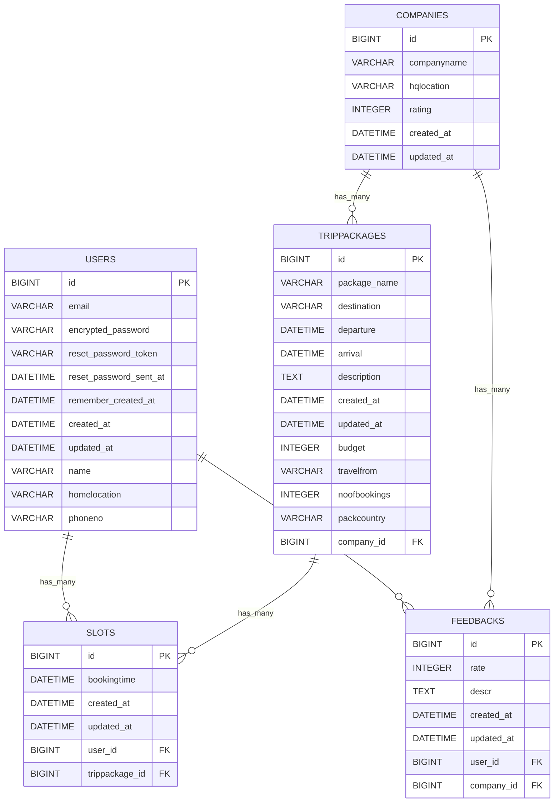

## Data & Persistence Layer

The application interacts with a **MySQL** database. The data model is defined using ActiveRecord, providing an Object-Relational Mapping (ORM) layer.

### Entities

*   **`User`**: Manages user accounts with attributes for authentication (email, encrypted password), personal details (name, homelocation, phoneno), and timestamps.
    *   Associations: `has_many :slots`, `has_many :feedbacks`.
*   **`Company`**: Stores information about travel companies.
    *   Attributes: `companyname`, `hqlocation`, `rating`, timestamps.
    *   Associations: `has_many :trippackages`, `has_many :feedbacks`.
*   **`Trippackage`**: Represents available travel packages.
    *   Attributes: `package_name`, `destination`, `departure`, `arrival`, `budget`, `description`, `travelfrom`, `noofbookings`, `packcountry`, timestamps.
    *   Associations: `has_many :slots`, `belongs_to :company`.
*   **`Slot`**: Represents a booking for a trip package by a user.
    *   Attributes: `bookingtime`, timestamps.
    *   Associations: `belongs_to :user`, `belongs_to :trippackage`.
*   **`Feedback`**: Stores user feedback for companies.
    *   Attributes: `rate`, `descr`, timestamps.
    *   Associations: `belongs_to :user`, `belongs_to :company`.

### Database Schema

