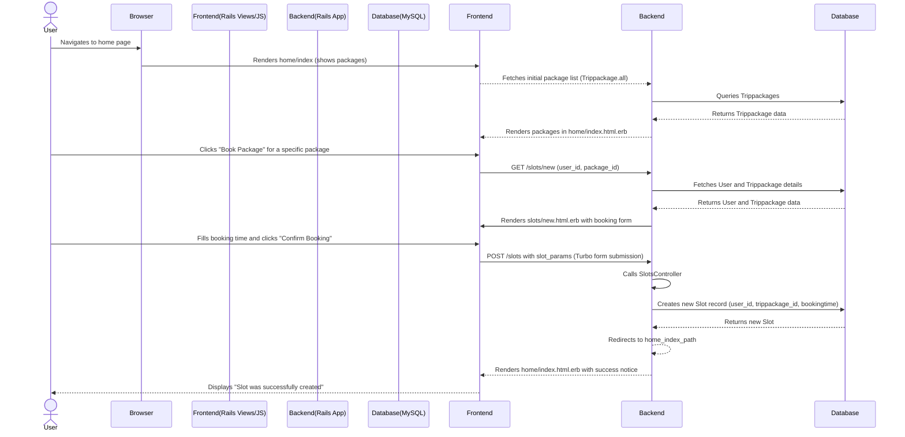

## Sequence Diagram: User Books a Trip Package

This diagram illustrates the flow when an authenticated user attempts to book a trip package.

```mermaid
sequenceDiagram
    actor User
    participant Browser
    participant Frontend(Rails Views/JS)
    participant Backend(Rails App)
    participant Database(MySQL)

    User->>Browser: Navigates to home page
    Browser->>Frontend: Renders home/index (shows packages)
    Frontend-->>Backend: Fetches initial package list (Trippackage.all)
    Backend->>Database: Queries Trippackages
    Database-->>Backend: Returns Trippackage data
    Backend-->>Frontend: Renders packages in home/index.html.erb

    User->>Frontend: Clicks "Book Package" for a specific package
    Frontend->>Backend: GET /slots/new (user_id, package_id)
    Backend->>Database: Fetches User and Trippackage details
    Database-->>Backend: Returns User and Trippackage data
    Backend->>Frontend: Renders slots/new.html.erb with booking form

    User->>Frontend: Fills booking time and clicks "Confirm Booking"
    Frontend->>Backend: POST /slots with slot_params (Turbo form submission)
    Backend->>Backend: Calls SlotsController#create
    Backend->>Database: Creates new Slot record (user_id, trippackage_id, bookingtime)
    Database-->>Backend: Returns new Slot
    Backend-->>Backend: Redirects to home_index_path
    Backend-->>Frontend: Renders home/index.html.erb with success notice
    Frontend-->>User: Displays "Slot was successfully created"
```
